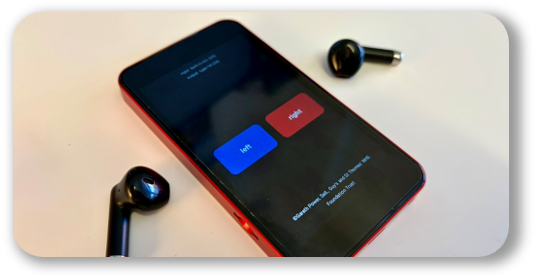

	

# EP-Communicator

EP-Communicator is a simple Android app for simulated education scenarios where a facilitator needs to speak privately to embedded participants or plants.

The usual setup is one Android phone, two listeners, and one earphone each. While you hold the left or right button, your voice is sent only to that side, letting you direct prompts or information to one person without the other hearing it.

## What It Is For

This app is intended for use in simulation-based education where communication needs to be discreet, fast, and easy to control.

Examples:

- coaching an embedded participant during a scenario
- feeding lines or prompts to a plant
- giving separate instructions to two different listeners

## How It Works

- The app uses the phone microphone as input.
- Two large on-screen buttons control where your voice is sent.
- Hold `left` to send your voice to the left audio channel only.
- Hold `right` to send your voice to the right audio channel only.
- Release the button to stop transmitting.

If each listener is wearing a single earphone, one on the left channel and one on the right, you can address each person separately from the same device.

## Installing The App

The easiest way to use the app is to install the APK from the repository's Releases page.

### Install From GitHub Releases

1. Open the latest release in this repository.
2. Download the APK file to your Android device.
3. Open the APK.
4. If prompted, allow installation from unknown sources for the browser or file manager you used.
5. Complete the installation.

Because the APK is distributed outside the Google Play Store, Android may describe it as an app from an unknown source. That is expected for the release APK.

## First-Time Setup

1. Connect your bluetooth earphones.
2. Give one person the left earphone.
3. Give the other person the right earphone.
4. Open the app.
5. Allow microphone access when prompted.

For best results, test the audio routing before starting a live scenario.

## Recommended Use

- Use a physical Android phone rather than an emulator.
- Use "true-wireless" bluetooth earphones.
- Keep the phone close enough for clear microphone pickup.
- Run a quick left/right check with both listeners before the session begins.
- Make sure the phone has enough battery for the full scenario.

## Permissions

The app requests microphone permission because it needs live audio input from the device.

## Notes

- The screen is kept awake while the app is open.
- The app is designed to be simple and full-screen so it can be used quickly during teaching sessions.
- Editable labels are availble to indicate who has each earphone.

## Troubleshooting

If audio is not working as expected:

- check that microphone permission has been granted
- confirm the earphones are connected properly
- verify which device is shown as the active output
- test both left and right buttons before use
- disconnect and reconnect Bluetooth if routing looks wrong

## Releases

If you just want to use the app, go to Releases and download the latest APK rather than building from source.

## License

This project is licensed under the GNU Affero General Public License v3.0. See the `LICENSE` file for the full text.

Copyright (C) 2026 Guy's & St Thomas' NHS Foundation Trust - Simulation and Interactive Learning - Gareth Power.
